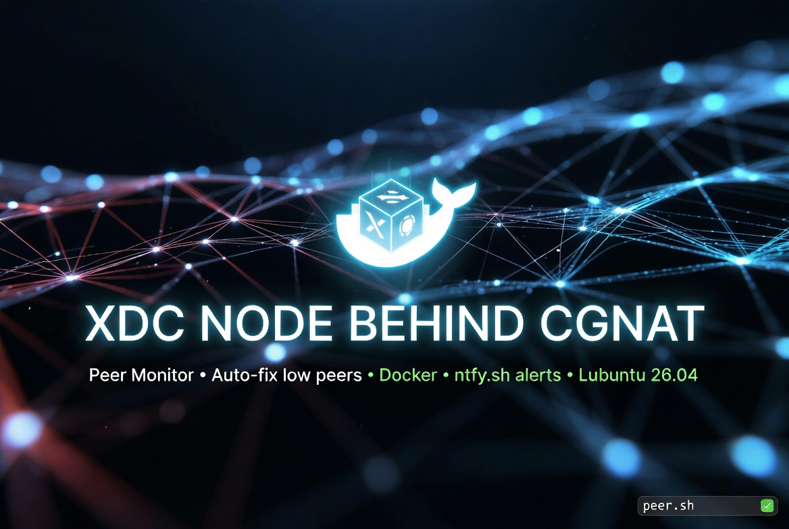

Project in still under construction. Not working yet. Released under MIT license. Feel free to build or improve further.

# XDC_Node_Behind_CGNAT



**Automatically keeps your XDC node fully peered even when running behind CGNAT or strict firewalls.**

This lightweight monitor runs on the same Ubuntu/Lubuntu 26.04 machine as your Dockerized XDC node and:
- Checks peer count **directly inside the Docker container** (no RPC required)
- Automatically runs `peer.sh` when peers drop below a configurable threshold (default: 15)
- Sends instant notifications to your iOS/Android phone via [ntfy.sh](https://ntfy.sh)
- Supports easy pause/restart controls
- Starts automatically after every reboot via systemd

Perfect for home, lab, or VPS XDC node operators who struggle with low peer counts due to CGNAT.

---

## ✨ Features

- ✅ **Docker-native** peer checking using `admin.peers.length` (with `net.peerCount` fallback)
- ✅ Fully configurable (threshold, check interval, node name, ntfy topic, container name)
- ✅ Beautiful ntfy.sh alerts with priority tags and emojis
- ✅ Simple pause / restart helper scripts
- ✅ Systemd service for automatic startup on boot
- ✅ Clean logging to `~/xdc-cgnat-monitor.log`
- ✅ Zero RPC dependency — works directly with your running XDC Docker container

---

## 📁 Files Included

- `xdc-behind-cgnat.sh` → Main monitoring daemon
- `xdc-behind-cgnat-pause.sh` → Pause the monitor
- `xdc-behind-cgnat-restart.sh` → Resume the monitor

---

## 🚀 Quick Start

1. Clone the repository:
   ```bash
   git clone https://github.com/YOURUSERNAME/XDC_Node_Behind_CGNAT.git
   cd XDC_Node_Behind_CGNAT
   ```

2. Make scripts executable:
   ```bash
   chmod +x *.sh
   ```

3. Add your user to the docker group (recommended, so no sudo is needed):
   ```bach
   sudo usermod -aG docker $USER
   ```
   Then reboot your machine.


4. Edit the configurable variables at the top of `xdc-behind-cgnat.sh` (especially `CONTAINER_NAME` and `NTFY_TOPIC`).

5. Install the systemd service (one-time setup):
   ```bash
   sudo ./install-service.sh   # (or follow the manual instructions below)
   ```

---

## ⚙️ Configuration

All settings are at the very top of `xdc-behind-cgnat.sh`:

| Variable                | Description                                      | Default          |
|-------------------------|--------------------------------------------------|------------------|
| `THRESHOLD`             | Minimum peers before running `peer.sh`           | 15               |
| `CHECK_INTERVAL_MINUTES`| How often to check the node                      | 60               |
| `FRIENDLY_NAME`         | Name shown in ntfy.sh alerts                     | "My XDC Node"    |
| `NTFY_TOPIC`            | Your ntfy.sh channel/topic                       | your-ntfy-topic  |
| `CONTAINER_NAME`        | Exact name from `docker ps`                      | "xinfinnetwork"  |
| `BINARY_NAME`           | Usually `XDC`                                    | "XDC"            |


---

## ⏸️ Pause & Resume

```bash
./xdc-behind-cgnat-pause.sh      # Temporarily stop monitoring
./xdc-behind-cgnat-restart.sh    # Resume monitoring
```

---

## 🔌 RPC Behind CGNAT (Coming Soon)

**Development in progress** — Full RPC support for XDC nodes running behind CGNAT is currently being developed and is scheduled for a future release once ready.

---

## 🔧 Systemd Service Installation (Manual)

If you prefer not to use `install-service.sh`, run these commands once:

```bash
sudo tee /etc/systemd/system/xdc-cgnat-monitor.service > /dev/null <<EOF
[Unit]
Description=XDC CGNAT Peer Monitor
After=network.target docker.service

[Service]
Type=simple
User=$USER
WorkingDirectory=$(pwd)
ExecStart=$(pwd)/xdc-behind-cgnat.sh
Restart=always
RestartSec=10
StandardOutput=append:$HOME/xdc-cgnat-monitor.log
StandardError=append:$HOME/xdc-cgnat-monitor.log

[Install]
WantedBy=multi-user.target
EOF

sudo systemctl daemon-reload
sudo systemctl enable xdc-cgnat-monitor.service
sudo systemctl start xdc-cgnat-monitor.service
```
Check status:
```bash
systemctl status xdc-cgnat-monitor.service
```

---

## 📜 License

This project is licensed under the **MIT License** — free to use, modify, and share.

---

**Made for the XDC community** ❤️  
Having trouble with low peers behind CGNAT? This script solves it automatically.

Star the repo if it helps you keep your node healthy!

